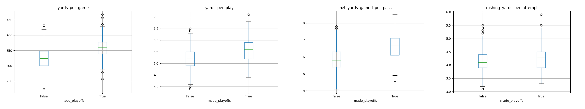
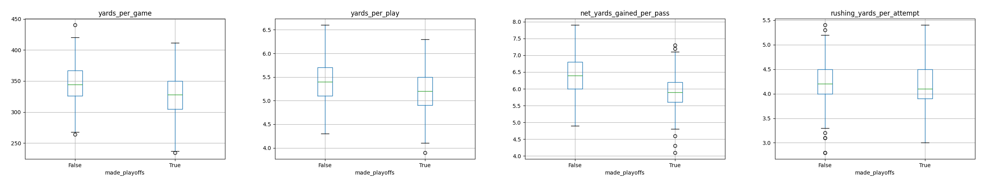
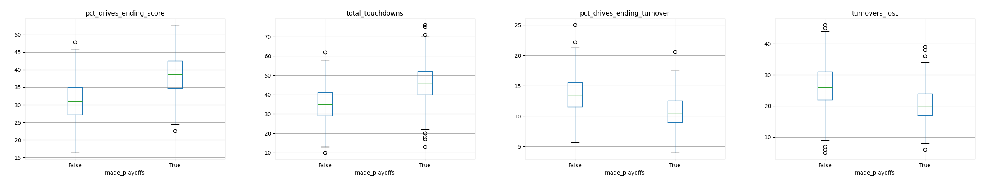
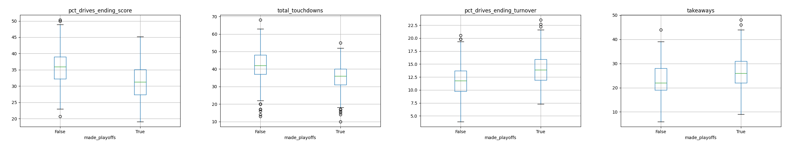
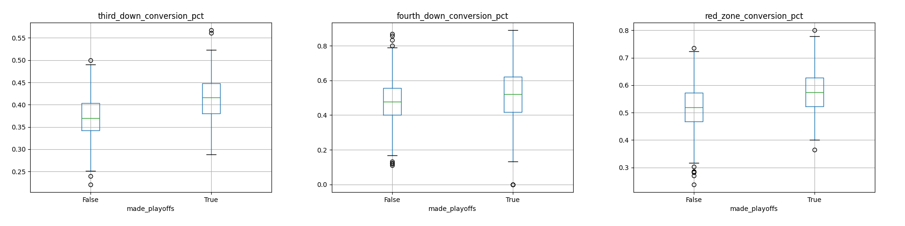
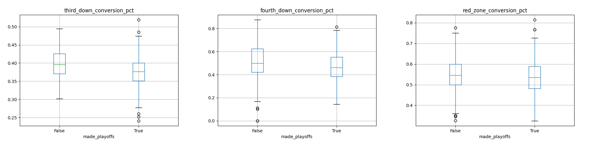
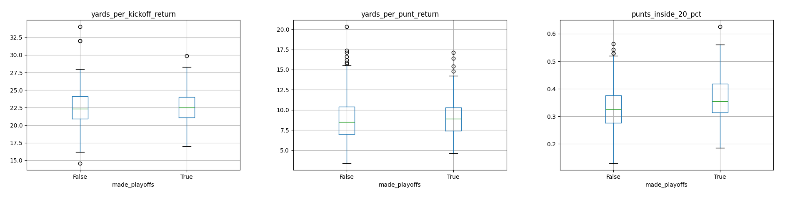
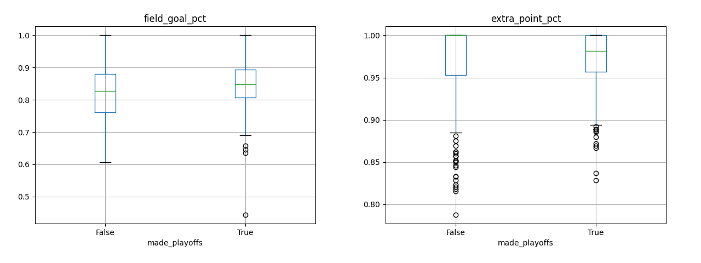
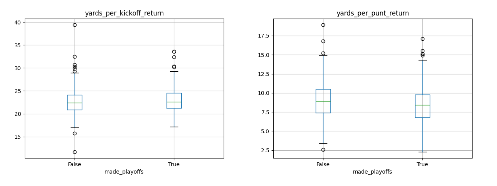

# FootStatsPro: Football Data Mining and Playoff Predictive Analytics

This project presents a rigorous statistical analysis of the factors influencing National Football League (NFL) team qualification for the playoffs, leveraging a comprehensive database encompassing end-of-season offense, defense, kicking, punting, and special teams statistics. The study employs a multifaceted approach, utilizing statistical tests such as t-tests, XGBoost, and Principal Component Analysis (PCA) to identify and extract the most influential factors affecting playoff outcomes.

The research delves into both offensive and defensive dimensions, unraveling the intricate interplay between various performance metrics and postseason success. Through systematic examination and hypothesis testing, the study aims to contribute valuable insights into the nuanced dynamics that separate playoff-bound teams from those falling short.

Key objectives include identifying statistically significant indicators and elucidating their impact on playoff qualification. By employing PCA and XGBoost, the project seeks to distill complex datasets into their essential components, offering a clearer understanding of the critical variables at play. This research not only sheds light on the relative importance of different offensive and defensive metrics but also provides a holistic perspective on the role of special teams and kicking in determining playoff success.

The findings of this study are expected to provide NFL analysts, coaches, and enthusiasts with actionable insights, enabling more informed decision-making and strategic planning. Furthermore, the methodology employed in this research may serve as a template for similar analyses in other sports contexts, contributing to the broader field of sports analytics.

## Data Dictionary

For a detailed understanding of each column in the dataset, refer to the [Factor Dictionary](factor_dictionary.md), which provides clear explanations for metrics such as total yards, turnovers, passing efficiency, and more. This dictionary serves as a valuable resource for researchers and analysts aiming to unravel the intricacies of NFL team performance.

## Analytics 
### t-test

In the investigation of factors influencing NFL playoff qualification, a t-test is employed to assess the significance of individual factors related to offense, defense, and special teams. The t-test is a statistical method that evaluates whether the means of two groups, in this case, playoff and non-playoff teams, are significantly different from each other. By calculating the t-statistic and obtaining a p-value, researchers can determine the probability of observing such a difference by random chance alone.

Setting a significance level, or alpha, at 0.05, if the p-value is below this threshold, it indicates that the observed difference is unlikely due to chance, suggesting that the factor may be a meaningful predictor of playoff success.

### Gradient Boosting

Continuing the investigation into the factors impacting NFL playoff qualification, classification using XGBoost is employed to extract the significance of each factor. XGBoost, an advanced machine learning algorithm, allows for a more sophisticated analysis of how offensive, defensive, and special teams metrics collectively contribute to predicting whether a team makes the playoffs or not.

In this approach, XGBoost assigns importance scores to each feature, revealing the relative significance of different factors in determining playoff outcomes. By leveraging the strengths of gradient boosting and decision tree ensembles, XGBoost excels at capturing complex relationships within the data.

This classification technique goes beyond traditional regression methods, providing a predictive model that can identify patterns and interactions among various performance metrics. The importance scores derived from XGBoost shed light on which factors play a pivotal role in distinguishing playoff-bound teams from those that do not qualify. Utilizing XGBoost for classification enhances the depth of analysis, offering valuable insights into the nuanced dynamics that underlie NFL playoff success.

### Principal Component Analysis (PCA)
In the final stage of our exploration into the factors influencing NFL playoff qualification, Principal Component Analysis (PCA) is employed to distill the significance of each factor. PCA is a dimensionality reduction technique that transforms the original variables, such as offensive, defensive, and special teams metrics, into a set of linearly uncorrelated components.

By applying PCA, we aim to identify the most influential components that contribute to the variability in playoff outcomes. This method allows us to uncover latent patterns and relationships within the data, providing a simplified yet informative representation of the key factors at play.

PCA serves as a valuable tool for feature extraction and dimensionality reduction, offering a unique perspective on the underlying structure of the data. By examining the loadings of each variable on the principal components, we gain insights into which offensive, defensive, and special teams metrics contribute most significantly to the variability in NFL playoff qualification. PCA adds depth to our analysis by revealing the fundamental factors that shape a team's success in securing a coveted playoff spot.

## Related Work
(Fokoue 2001): This paper employs machine learning and data mining methods to analyze various performance metrics in American football, aiming to identify key factors contributing to the success of top NFL teams. The study encompasses a broad range of performance statistics and variables, including winning percentage, playoff appearances, and championship wins. The research specifically investigates the widely held notion that defense plays a crucial role in winning championships. Additionally, the paper explores the claim that a high third-down conversion percentage is indicative of playoff and championship-caliber teams. By utilizing five years of data from 2006 to 2010, the authors apply cluster analysis, principal component analysis, factor analysis, support vector machine, and traditional logistic regression. The results consistently reveal compelling and intriguing elements that contribute to the greatness of NFL teams over the years.

## Analysis
In our comprehensive analysis of football team performance, we employ an extensive dataset comprising over 40 offensive and defensive variables (see [Factor Dictionary](factor_dictionary.md)). By examining a wide array of metrics, we aim to discern the key factors that contribute to a team's success on the field. To gauge the overall effectiveness of a team, we utilize a binary variable indicating playoff participation – a decisive measure of performance. Our study spans the seasons from 2003 to 2022, allowing us to capture and analyze the evolving landscape of football over this substantial timeframe. 

### Boxplots
In the inaugural stage of our analysis, we are employing boxplots to visually unravel the pivotal factors that determine a team's fate in the NFL playoffs.
A stark contrast emerges in offensive factors between playoff and non-playoff teams. 

#### Offensive Yards

Diving into the statistical arena, our initial exploration revolves around the boxplots of crucial offensive yardage metrics, including yards per game, yards per play, yards per pass, and yards per run. The visual narrative that unfolds is compelling, painting a distinct picture of playoff-bound teams boasting higher means and medians across these yardage categories in comparison to their non-playoff counterparts. 

#### Defensive Yards

Shifting our focus to the defensive side of the gridiron, a distinct pattern emerges as we examine the yardage metrics. Boxplots vividly depict that playoff teams consistently boast lower means and medians across yards per game, yards per play, yards per pass, and yards per run when compared to their non-playoff counterparts. 

#### Offensive Touchdown vs. Turnover

Expanding our analytical lens to encompass touchdown and turnover metrics, a compelling trend materializes within the realm of NFL playoff dynamics. Boxplots vividly illustrate that playoff-bound teams showcase a distinct advantage in both total touchdowns and the percentage of drives culminating in scoring plays. Equally noteworthy is the offensive prowess exhibited by playoff teams, as reflected in the smaller percentages of drives ending in turnovers and the overall reduction in total turnovers. 

#### Defensive Touchdown vs. Turnover

In the realm of defensive metrics, a discernible pattern takes shape as we scrutinize the touchdowns and takeaway statistics for playoff teams. The boxplots illuminate a consistent trend where playoff-bound teams showcase lower means and medians in total touchdowns allowed and touchdown percentage, indicative of a staunch defensive resilience that mitigates opponents' ability to reach the end zone. Simultaneously, the higher means and medians in both takeaways and takeaway percentage for playoff teams suggest an increased propensity for forcing turnovers. 

#### Conversion Rates Offense

Delving deeper into the intricate fabric of NFL team dynamics, our exploration extends to the critical domains of third and fourth-down conversion rates, as well as red zone efficiency. The boxplots tell a compelling tale, revealing that playoff teams consistently exhibit higher means and medians in these conversion metrics compared to their non-playoff counterparts. 

#### Conversion Rates Defense

 The boxplots illuminate a consistent narrative wherein playoff-bound teams exhibit lower means and medians in opponent third-down, fourth-down, and red zone conversion percentages. This defensive prowess signifies an enhanced capacity to thwart opponents when it matters most, denying crucial conversions on third and fourth downs and tightening the defensive screws within the red zone. 

#### Special Teams Offense

#### Special Teams Defense

Interestingly, the same level of influence does not extend to special teams. Our analysis suggests that, unlike their offensive and defensive counterparts, the specialized units on the field may not wield as much impact in determining playoff success.

### Two-Sample t-test
A two-sample t-test, or independent-sample test, assesses the differences between the means of two distinct sample groups. The objective is to compare the means of samples originating from separate populations. 
In this study, a two-sample t-test is employed to examine the significance of a variable in predicting whether a team reaches the NFL playoffs or not. The p-value, with a predetermined significance level of 0.05, is utilized to evaluate the results. The null hypothesis posits that the means of the two populations are equal.

#### Offensive Factors
| Factor                       |     t-stat |       p-value | Significant   |
|:-----------------------------|-----------:|--------------:|:--------------|
| total_yards                  |   7.96996  |   6.84565e-15 | True          |
| offensive_plays              |   1.77828  |   0.0758115   | False         |
| yards_per_play               |  11.525    |   3.65651e-28 | True          |
| turnovers_lost               | -11.2005   |   8.24029e-27 | True          |
| first_downs                  |   7.99832  |   5.54953e-15 | True          |
| passes_completed             |   2.07982  |   0.0379217   | True          |
| passes_attempted             |  -1.6939   |   0.0907486   | False         |
| net_yards_gained_per_pass    |  13.686    |   8.93865e-38 | True          |
| yards_passing                |   5.5797   |   3.49946e-08 | True          |
| touchdowns_passing           |  10.5858   |   2.54959e-24 | True          |
| interceptions                | -11.1293   |   1.61911e-26 | True          |
| rushing_attempted            |   6.61435  |   7.63534e-11 | True          |
| yards_rushing                |   6.55175  |   1.13404e-10 | True          |
| rushing_yards_per_attempt    |   3.1001   |   0.00201563  | True          |
| touchdowns_rushing           |  10.2208   |   6.90777e-23 | True          |
| penalties_opponent           |  -3.00033  |   0.002797    | True          |
| yards_penalties_opponent     |  -2.0011   |   0.0457845   | True          |
| pct_drives_ending_score      |  16.5992   |   4.3457e-52  | True          |
| pct_drives_ending_turnover   | -12.4765   |   2.846e-32   | True          |
| completion_pct               |   9.64196  |   1.08853e-20 | True          |
| yards_per_game               |  12.1731   |   6.11952e-31 | True          |
| touchdown_interception_ratio |  11.5486   |   2.90962e-28 | True          |
| pass_run_ratio               |  -5.94299  |   4.50078e-09 | True          |
| total_touchdowns             |  14.3426   |   7.00331e-41 | True          |
| two_points_made              | nan        | nan           | False         |
| two_points_attempted         |  -1.56384  |   0.118328    | False         |
| extra_points_made            |  14.98     |   5.74345e-44 | True          |
| extra_points_attempted       |  14.9351   |   9.5204e-44  | True          |
| field_goals_made             |   5.13412  |   3.71955e-07 | True          |
| field_goals_attempted        |   3.83797  |   0.000135798 | True          |
| points_per_game              |  18.3368   |   3.59444e-61 | True          |
| field_goal_pct               |   4.23152  |   2.64468e-05 | True          |
| extra_point_pct              |   1.09012  |   0.276054    | False         |
| two_point_pct                | nan        | nan           | False         |
| punts_returned               |   2.53783  |   0.0113796   | True          |
| yards_per_punt_return        |   0.398228 |   0.690589    | False         |
| kickoffs_returned            |  -4.79048  |   2.04991e-06 | True          |
| yards_per_kickoff_return     |   0.557422 |   0.577425    | False         |
| all_purpose_yards            |   4.46549  |   9.3738e-06  | True          |
| punts_avg_yards              |  -0.168695 |   0.866088    | False         |
| punts_touchback_pct          |   1.414    |   0.157827    | False         |
| punts_inside_20_pct          |   5.98234  |   3.58061e-09 | True          |
| third_down_conversion_pct    |  11.8198   |   2.05276e-29 | True          |
| fourth_down_conversion_pct   |   3.50629  |   0.00048472  | True          |
| red_zone_conversion_pct      |   8.42125  |   2.26206e-16 | True          |

Factors such as total yards, yards per play, turnovers lost, first downs, and several others exhibit statistically significant relationships with playoff qualification, as indicated by low p-values. On the other hand, factors like offensive plays, passes attempted, two points made, extra point percentage, and others do not show significant associations based on the given significance level.

#### Defensive Factors
| Factor                         |     t-stat |       p-value | Significant   |
|:-------------------------------|-----------:|--------------:|:--------------|
| points_against                 | -12.3634   |   8.98605e-32 | True          |
| total_yards                    |  -5.59248  |   3.26194e-08 | True          |
| defensive_plays                |  -2.23822  |   0.0255346   | True          |
| yards_per_play                 |  -7.30652  |   7.81961e-13 | True          |
| takeaways                      |   6.93697  |   9.45899e-12 | True          |
| first_downs                    |  -4.74788  |   2.5151e-06  | True          |
| passes_completed               |   1.35709  |   0.175209    | False         |
| passes_attempted               |   4.09686  |   4.70068e-05 | True          |
| yards_passing                  |  -2.28623  |   0.0225522   | True          |
| touchdowns_passing             |  -5.82251  |   8.99494e-09 | True          |
| interceptions                  |   6.7789   |   2.65898e-11 | True          |
| net_yards_gained_per_pass      | -11.057    |   3.2067e-26  | True          |
| rushing_attempted              | -10.1701   |   1.08476e-22 | True          |
| yards_rushing                  |  -8.56071  |   7.65498e-17 | True          |
| touchdowns_rushing             |  -8.45794  |   1.70328e-16 | True          |
| rushing_yards_per_attempt      |  -2.07839  |   0.0380537   | True          |
| penalties_commited             |   0.119547 |   0.904878    | False         |
| yards_penalties_commited       |   0.357859 |   0.720561    | False         |
| first_downs_penalties_commited |  -1.42415  |   0.154869    | False         |
| pct_drives_ending_score        | -11.6182   |   1.47818e-28 | True          |
| pct_drives_ending_turnover     |   9.35169  |   1.26884e-19 | True          |
| completion_pct                 |  -5.56258  |   3.84398e-08 | True          |
| yards_per_game                 |  -8.14845  |   1.80896e-15 | True          |
| touchdown_interception_ratio   |  -6.74363  |   3.33969e-11 | True          |
| total_touchdowns               | -10.9668   |   7.48136e-26 | True          |
| points_per_game                | -15.3159   |   1.27586e-45 | True          |
| punts_returned                 |  -8.17512  |   1.47972e-15 | True          |
| yards_per_punt_return          |  -2.52464  |   0.0118113   | True          |
| kickoffs_returned              | nan        | nan           | False         |
| yards_per_kickoff_return       | nan        | nan           | False         |
| punts_avg_yards                |   1.49969  |   0.134165    | False         |
| third_down_conversion_pct      |  -6.40454  |   2.83942e-10 | True          |
| fourth_down_conversion_pct     |  -4.5538   |   6.25847e-06 | True          |
| red_zone_conversion_pct        |  -1.76204  |   0.0785182   | False         |

Factors such as points against, total yards allowed, defensive plays, yards per play allowed, takeaways, first downs allowed, passes attempted against, interceptions gained, net yards gained per pass allowed, rushing attempts against, yards rushing allowed, touchdowns rushing allowed, third-down conversion percentage allowed, fourth-down conversion percentage allowed, and several others exhibit statistically significant relationships with defensive performance. This is evidenced by low p-values.
On the other hand, surprisingly factors like passes completed against, penalties committed, yards penalties committed, first downs from penalties committed, punts average yards, red zone conversion percentage allowed, kickoffs returned, and yards per kickoff return do not show significant associations based on the given significance level.

## Next Steps
1. Predicting Regular Season Performance: Develop models to predict a team's regular-season performance, considering factors such as player statistics, team dynamics, strength of schedule, and historical performance. 
2. Draft Strategy Evaluation: Assess the effectiveness of teams' draft strategies by analyzing the performance of drafted players over time. Examine whether high draft picks lead to improved playoff prospects.
3. Home Field Advantage Analysis: Study the significance of home field advantage in the context of playoff qualification. Analyze teams' performance at home versus away and assess whether certain teams consistently perform better in specific environments.
4. Weather Impact on Performance: Investigate how weather conditions during games influence team performance. Consider factors like temperature, precipitation, and wind speed 
5. Game Outcome Prediction: Extend the analysis to predict the outcome of individual games during the regular season. Explore how well models can predict wins and losses based on various factors.
6. Coin Toss Analysis: Explore the impact of the coin toss on a team's success. Investigate whether winning the coin toss at the beginning of a game correlates with a higher likelihood of winning.

# References

## Data

The data structure is displayed in [this database relation diagram](https://dbdiagram.io/d/Fantasy-65446f667d8bbd646565521a).

- [ ] FantasyData. (11/2023). Fantasy Football Stats and Season Leaders. https://fantasydata.com/nfl/fantasy-football-leaders
- [ ] SportsOddsHistory. (11/2023). Historical NFL Game Odds. https://www.sportsoddshistory.com/nfl-game-odds/
- [x] Pro Football Reference. (11/2023). NFL Coaches. https://www.pro-football-reference.com/years/2023/coaches.htm
- [x] Pro Football Reference. (11/2023). NFL, AFL, and AAFC Stadiums. https://www.pro-football-reference.com/stadiums/
- [x] Pro Football Reference. (11/2023). NFL Weeks. https://www.pro-football-reference.com/years/2023/games.htm
- [x] Pro Football Reference. (11/2023). NFL Standings & Team Stats. https://www.pro-football-reference.com/years/2023/

## Research
- [x] [Baughman, A., Forester, M., Powell, J., Morales, E., McPartlin, S., & Bohm, D. (2021). Deep Artificial Intelligence for Fantasy Football Language Understanding.](https://arxiv.org/ftp/arxiv/papers/2111/2111.02874.pdf)
- [x] [Fokoue, E., and Foehrenbach D. (2001). A statistical data mining approach to determining the factors that distinguish championship caliber teams in the National Football League.](https://scholarworks.rit.edu/cgi/viewcontent.cgi?article=2749&context=article)
- [x] [Gupta, A. (2019). Time Series Modeling for Dream Team in Fantasy Premier League](https://arxiv.org/ftp/arxiv/papers/1909/1909.12938.pdf)
- [x] [Lutz, R. (2015). Fantasy Football Prediction.](https://arxiv.org/pdf/1505.06918.pdf)
- [ ] [Ramdas, Delano. (2022). Using Convolution Neural Networks to Predict the Performance of Footballers in the Fantasy Premier League.](https://www.researchgate.net/publication/360009648_Using_Convolution_Neural_Networks_to_Predict_the_Performance_of_Footballers_in_the_Fantasy_Premier_League)
